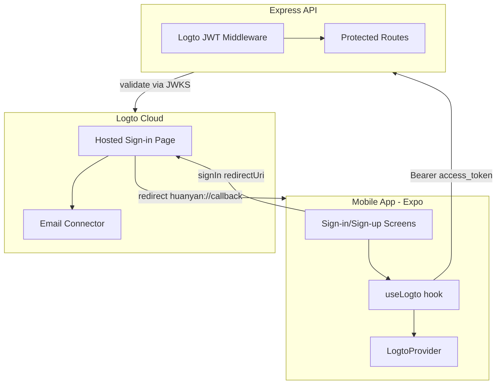

# Logto Authentication Integration Plan (Email Only)

## Architecture Overview



**Flow:** User taps "登录" or "注册并登录" on the app screen, which calls `signIn('huanyan://callback')`. The SDK opens the system browser to Logto's hosted sign-in page (email + password). After authentication, Logto redirects back to `huanyan://callback`, and the app receives tokens. The app fetches an access token for your backend API resource, stores it, and sends it as `Authorization: Bearer <token>` on every API call so protected routes return real-time data.

---

## Part 1: Logto Console Configuration (Manual Steps)

### 1.1 Redirect URL

- Go to [Logto Console](https://cloud.logto.io) -> Applications -> your native app
- Under "Redirect URIs", add: `**huanyan://callback**`
- Save

Your app already has `"scheme": "huanyan"` in [mobile/app.json](mobile/app.json), which matches this redirect URI for Android. iOS does not require scheme registration for `ASWebAuthenticationSession`.

### 1.2 Email Connector

- Go to **Connectors** -> **Email and SMS connectors** -> Set up
- Choose **Email** and select a provider (e.g. SendGrid, SMTP)
- Complete Parameter Configuration (SMTP host, user, password, etc.)
- Test sending a verification email, then **Save and Done**
- Reference: [Email connectors](https://docs.logto.io/connectors/email-connectors)
- Note: Logto Cloud may offer a dev email option for testing; use it if available before configuring production SMTP.

### 1.3 Sign-in Experience (Email Only)

- Go to **Sign-in experience** -> **Sign-up and sign-in**
- **Sign-up identifiers:** Email address only
- **Sign-up:** Enable "Verify at sign-up" (required for email), enable "Create your password"
- **Sign-in:** Add "Email address" with "Password"
- **Social sign-in:** Leave disabled (email only)
- Save

### 1.4 API Resource (for Backend)

- Go to **API resources** -> Create
- **Indicator:** Must match exactly in Logto, mobile `resources` config, and backend validation. Use `https://api.huanyan.com` for production, or `http://localhost:3000` for dev (Logto Cloud may allow http for localhost).
- **Permissions:** e.g. `read`, `write` or `api:read`, `api:write`
- Create a **Role** that includes these permissions, assign to users (or set as default role for new users)

---

## Part 2: Mobile App Implementation

### 2.1 Environment Variables

Create or update `mobile/.env` (and ensure it is in `.gitignore`):

```
EXPO_PUBLIC_LOGTO_ENDPOINT=https://your-tenant.logto.app
EXPO_PUBLIC_LOGTO_APP_ID=your-application-id
EXPO_PUBLIC_API_URL=http://localhost:3000
```

### 2.2 LogtoProvider Setup

Wrap the app in `LogtoProvider` in [mobile/app/_layout.tsx](mobile/app/_layout.tsx):

- Import `LogtoProvider`, `LogtoConfig`, `UserScope` from `@logto/rn`
- Add `scopes: [UserScope.Email]` to request email in claims
- Add `resources: [API_BASE or your API resource indicator]` so the app can obtain access tokens for your backend
- Use `endpoint` and `appId` from env

### 2.3 Auth Route Group

Create an auth route group to match the UI in your images:

- `**mobile/app/(auth)/_layout.tsx**` – Stack layout, no tabs
- `**mobile/app/(auth)/sign-in.tsx**` – Sign-in screen (欢迎回来)
- `**mobile/app/(auth)/sign-up.tsx**` – Sign-up screen (开启美丽之旅)

**Sign-in screen (sign-in.tsx):**

- Title: "欢迎回来", subtitle: "使用邮箱登录您的 GlowAI 账号"
- Decorative input placeholders (email, password) – actual auth happens on Logto
- Primary button "登录" → `signIn('huanyan://callback')`
- Links: "没有账号?立即注册" → router to sign-up, "忘记密码?" (Logto handles this on its page)
- Footer: 用户协议, 隐私政策 (links as needed)

**Sign-up screen (sign-up.tsx):**

- Title: "开启美丽之旅", subtitle: "立即注册,获取专属 AI 护肤方案"
- Decorative placeholders (邮箱, 验证码, 密码)
- Primary button "注册并登录" → `signIn('huanyan://callback')`
- Link: "已有账号?去登录" → router to sign-in
- Footer: same as sign-in

Use `useLogto()` for `signIn`, `signOut`, `isAuthenticated`, `isLoading`.

### 2.4 Auth Guard and Root Layout

- Update [mobile/app/_layout.tsx](mobile/app/_layout.tsx) to:
  - Wrap content in `LogtoProvider`
  - Use `useLogto` to read `isAuthenticated` and `isLoading`
  - When `isLoading`: show splash or loading indicator
  - When `!isAuthenticated` and not loading: redirect to `/(auth)/sign-in` or render `(auth)` routes only
  - When authenticated: show `(tabs)` and main app routes; fetch access token and call `setAuthToken` before any protected route mounts
- Use expo-router's `redirect` in root layout based on auth state so unauthenticated users cannot access tabs

### 2.5 Token Integration with API (Critical for Real-time Data)

To ensure authenticated users receive real-time data from protected routes:

- Create an `AuthContext` or `useAuthEffect` hook that runs when `isAuthenticated` becomes true:
  1. Call `getAccessToken(apiResourceIndicator)` from `useLogto`
  2. Call `setAuthToken(accessToken)` in [mobile/constants/api.ts](mobile/constants/api.ts)
  3. Logto SDK handles token refresh; re-fetch and update token before expiry when making API calls
- Ensure [mobile/constants/api.ts](mobile/constants/api.ts) sends `Authorization: Bearer <token>` on every request when token is set
- In profile, community, and other data screens: use `useFocusEffect` or `useEffect` with `isAuthenticated` as dependency so data refetches when user signs in
- Verify that `getAuthToken()` returns the Logto access token before any `apiGet`/`apiPost` calls; without this, protected routes return 401 and no data

### 2.6 Sign-out and Profile

- Add sign-out in [mobile/app/profile/settings.tsx](mobile/app/profile/settings.tsx) or profile screen
- Call `signOut()` and `setAuthToken(null)`

---

## Part 3: Backend Implementation

### 3.1 Logto JWT Validation

Replace custom JWT logic with Logto token validation:

- Install `jose`: `npm install jose`
- Create auth utilities (e.g. `backend/src/lib/logto-auth.ts`):
  - `JWKS_URI = ${LOGTO_ENDPOINT}/oidc/jwks`
  - `ISSUER = ${LOGTO_ENDPOINT}/oidc`
  - Extract Bearer token from `Authorization` header
  - Use `jose`’s `createRemoteJWKSet` + `jwtVerify` to validate
  - Verify `iss`, `aud` (API resource indicator), `exp`
  - Extract `sub` (Logto user ID) and optional `scope`

### 3.2 Update Auth Middleware

- Modify [backend/src/middleware/auth.ts](backend/src/middleware/auth.ts):
  - Use the new Logto validation instead of `jwt.verify` with `JWT_SECRET`
  - Set `req.userId` from a **local user ID** (see 3.3)
  - Keep the same `AuthRequest` interface for compatibility with existing routes

### 3.3 User Sync (Logto sub → Local User)

- Add column `logto_user_id` (varchar, unique) to `users` table in [backend/src/db/schema.ts](backend/src/db/schema.ts)
- Create a user sync helper: given Logto `sub`, fetch or create local user
  - If user exists by `logto_user_id`, return that user
  - Else create new user (nickname from Logto claims or placeholder, `logto_user_id` = sub)
- In auth middleware: after validating token, call sync helper, set `req.userId` to local user id

### 3.4 Environment Variables

Add to [backend/.env.example](backend/.env.example) and `.env`:

```
LOGTO_ENDPOINT=https://your-tenant.logto.app
LOGTO_API_RESOURCE=https://api.huanyan.com
```

### 3.5 Deprecate Custom Auth Routes

- [backend/src/routes/auth.ts](backend/src/routes/auth.ts): Remove or deprecate `/register` and `/login` (custom JWT-based auth)
- Keep `/me` but ensure it uses the new Logto-based middleware

---

## Part 4: File Changes Summary


| Location                         | Action                                          |
| -------------------------------- | ----------------------------------------------- |
| `mobile/app/_layout.tsx`         | Add LogtoProvider, auth-based routing           |
| `mobile/app/(auth)/_layout.tsx`  | New – auth stack layout                         |
| `mobile/app/(auth)/sign-in.tsx`  | New – sign-in screen (UI from image 1)          |
| `mobile/app/(auth)/sign-up.tsx`  | New – sign-up screen (UI from image 2)          |
| `mobile/constants/api.ts`        | Integrate Logto access token (via setAuthToken) |
| `mobile/.env`                    | Add EXPO_PUBLIC_LOGTO_* vars                    |
| `backend/src/lib/logto-auth.ts`  | New – Logto JWT validation                      |
| `backend/src/middleware/auth.ts` | Replace custom JWT with Logto validation        |
| `backend/src/db/schema.ts`       | Add logto_user_id to users                      |
| `backend/drizzle/`               | New migration for logto_user_id                 |
| `backend/.env.example`           | Add LOGTO_* vars                                |
| `backend/package.json`           | Add jose dependency                             |


---

## Part 5: Optional Enhancements

- **Forgot password:** Handled by Logto when enabled in sign-in experience; link can stay as-is
- **User agreement / Privacy policy:** Add real links in footer
- **Profile sync:** Use `fetchUserInfo()` or `getIdTokenClaims()` to display name/avatar from Logto

---

## Part 6: Real-time Data Verification

To confirm authentication and data flow work correctly:

1. **Token availability:** After sign-in, before rendering tabs, the app must call `getAccessToken(apiResourceIndicator)` and `setAuthToken(token)`. Profile and community screens rely on `getAuthToken()` for API calls.
2. **API requests:** [mobile/constants/api.ts](mobile/constants/api.ts) attaches `Authorization: Bearer ${token}` when `token` is set. Verify that profile, community, and analysis endpoints receive the token.
3. **Backend response:** Protected routes (`/user/profile`, `/user/skin-reports`, `/analysis/history`, `/community/posts`, etc.) must use Logto auth middleware and return real data for the authenticated user.
4. **Token refresh:** Logto RN SDK handles refresh tokens. If an API call returns 401, the app should call `getAccessToken` again (it will use refresh token) and retry, or redirect to sign-in if refresh fails.
5. **Refetch on auth change:** Profile and community screens should refetch data when `isAuthenticated` becomes true (e.g. via `useEffect` depending on auth state) so data appears immediately after sign-in.

---

## Testing Checklist

1. **Logto Console:** Redirect URI `huanyan://callback`, Email connector, sign-in experience (email + password), API resource, role with permissions
2. **Mobile:** Sign-in button opens Logto, complete email sign-in, redirect back to app, token stored via `setAuthToken`
3. **Mobile:** Sign-up flow works via Logto (email verification + password)
4. **Backend:** Protected routes accept Logto access token and reject invalid/missing tokens
5. **End-to-end:** Sign in on mobile, navigate to Profile and Community, verify real data loads (profile, skin reports, posts)
6. **Sign-out:** Sign out, verify tabs redirect to sign-in, and API calls no longer include token

